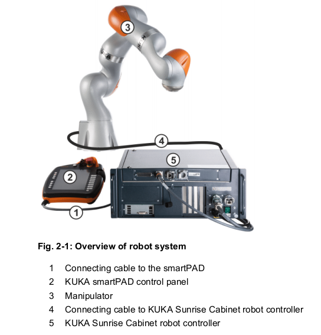
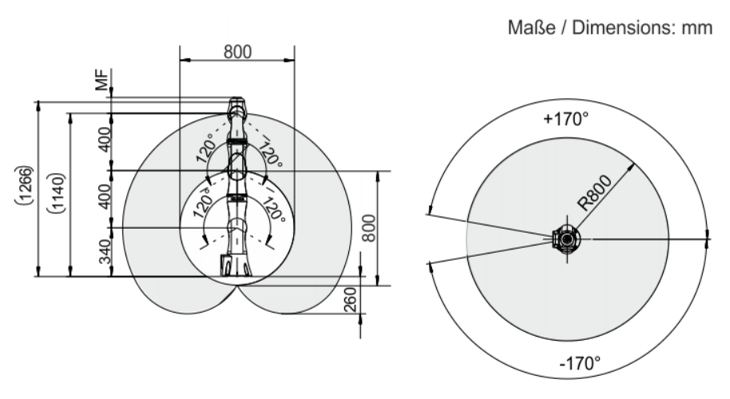
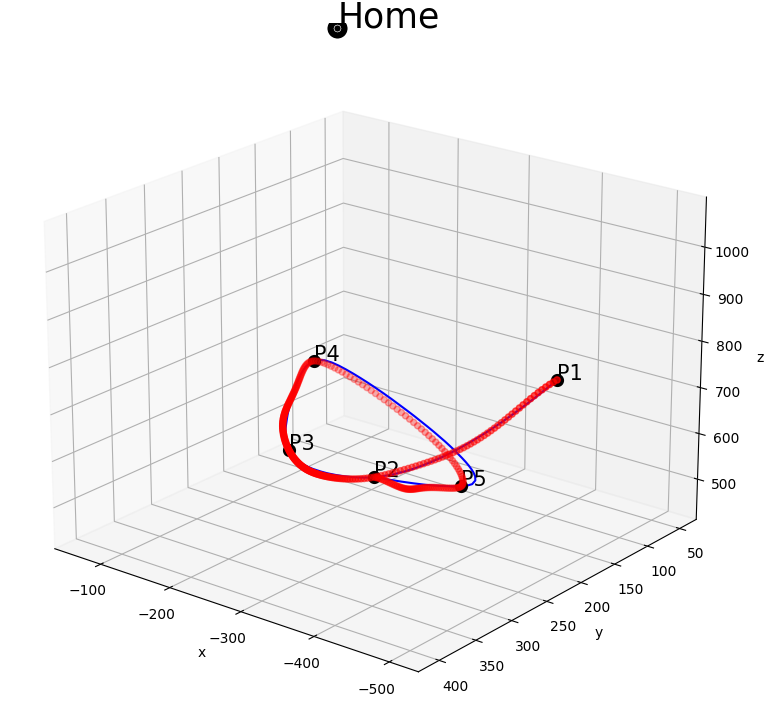
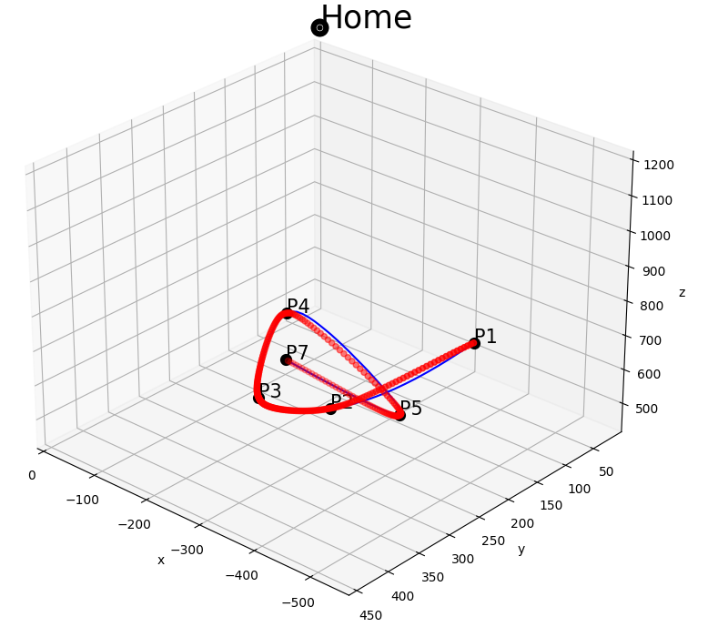
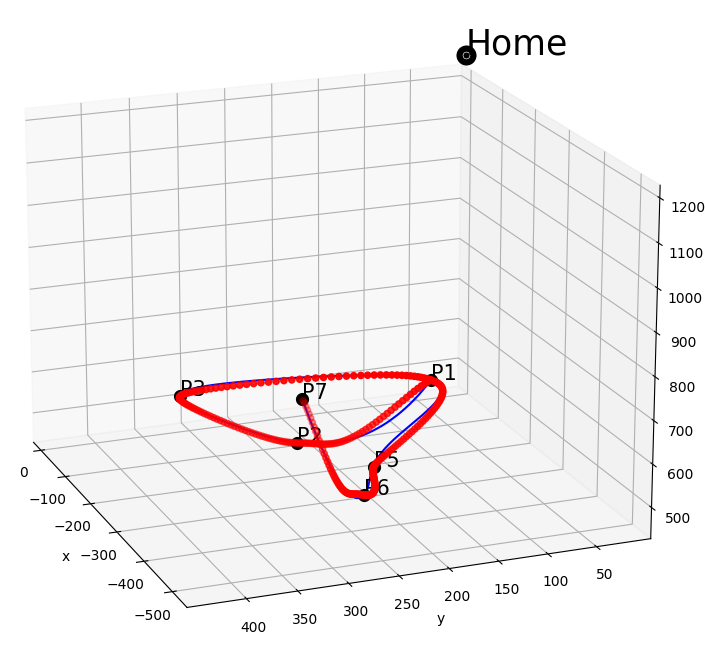
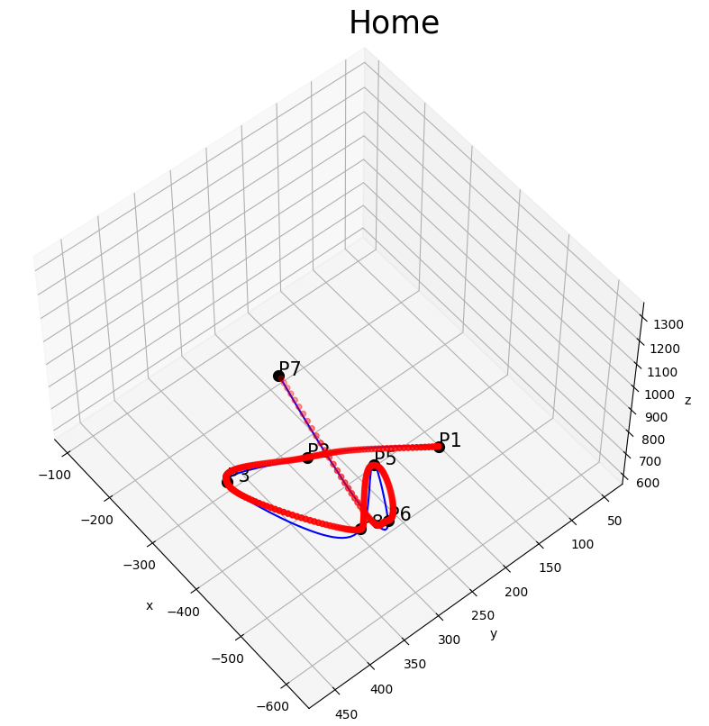
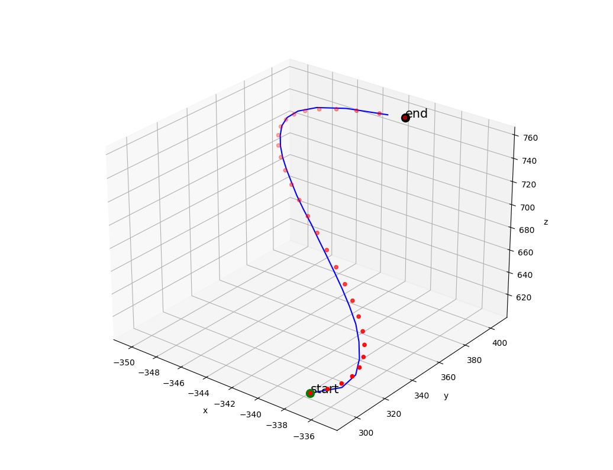
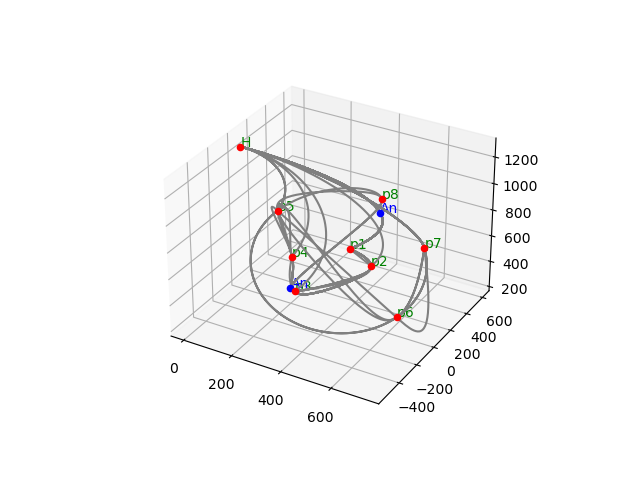

# Automated trajectory planning for offline robot programming
---
## KUKA LBR IIWA 7 R800

## Robot's trajectory (Red) vs Generated trajectory (Blue): 
==The better the result, the better the trajectories match==

- 14 Apr
	Project description_Project goals and sub tasks:
		1.  Fixing/deciding on an optimizing criteria for trajectory planning.
			1. Literature review on various optimization criteria based of area of application
			2. Gathering mathematical techniques to implement.        
		2.  Developing an algorithm for creating a trajectory path in 3d space.
		    1.  Literature review of preexisting algorithms, weighing down pros and cons.
		    2. Exploring both traditional algorithms and the machine learning techniques in trajectory planning.
		    3. Implementing the algorithm and test in simulated environment.
		3.  Execution of the trajectory by solving inverse kinematics problem.
		    1.  Analysis of mechanical constraints, obstacles etc.
		    2.  Representing constraints and obstacles mathematically.
		    3.  Calculating optimal solution and implementation.
		4.  Simulation of robotic arm, target and obstacles using a software.
  		   1.  Deciding on programming language of implementation, software for simulation and file formats etc.,
- 30 Apr 2020
	- coppelia sim software tutorial
		- static objects, dynamic objects, object properties in the simulation world (measurable, detectable, renderable, collidable)
		- traslation and rotation (position:cartesian || rotation: euler xyz)
		- joint types: revolute, prismatic, spherical...
		- joint modes: passive mode, inverse kinematic mode, dependen- 14 Apr
	Project description_Project goals and sub tasks:
		1.  Fixing/deciding on an optimizing criteria for trajectory planning.
			1. Literature review on various optimization criteria based of area of application
			2. Gathering mathematical techniques to implement.        
		2.  Developing an algorithm for creating a trajectory path in 3d space.
		    1.  Literature review of preexisting algorithms, weighing down pros and cons.
		    2. Exploring both traditional algorithms and the machine learning techniques in trajectory planning.
		    3. Implementing the algorithm and test in simulated environment.
		3.  Execution of the trajectory by solving inverse kinematics problem.
		    1.  Analysis of mechanical constraints, obstacles etc.
		    2.  Representing constraints and obstacles mathematically.
		    3.  Calculating optimal solution and implementation.
		4.  Simulation of robotic arm, target and obstacles using a software.
  		   1.  Deciding on programming language of implementation, software for simulation and file formats etc.,t mode, motion mode, torque/force mode
		- proximity sensors: ray type, pyramid type, cylinder type, disc type, cone type
		- vision sensors: orthographic type, perspective type
		- LVA programming language
			- data types, keywords, 
		- played around with "iiwa7_scene.ttt" file in coppelia sim.
---

- 8 may 2020
	- Vrep - inverse kinematics
		- can program in LUA. Python API's exist but with less functionality
		- Kinematics
			- Direct kinematics: calculate end point from angles of robot
			- Inverse kinematics
		- Denavit Hartemberg convention: a, alpha, d, theta
		- Start implementing the inverse and direct kinematics for 'KUKA LBR IIWA 7 R800'.
		- inverse kinematics implementation
		- Recieved DH parameters of KUKA robot and  input joint angles + necessary inputs needed for inverse kinematics.
- 15 may 2020
	- Project supervisor gave a detailed introduction to DH convention and KUKA.
- 28 may 2020
	- Inverse kinematics is implemented successfully, according to the paper "2018_Position-based kinematics for 7-DoF serial manipulators with global configuration control, joint limit and singularity avoidance"
---
- june 2020
	- OMPL - for trajectory planning
		- other opensource softwares that can be used for motion planning: MoveIt, CHOMP trajectory optimiser, TrajOpt, GPMP2.
	- Extracting CAD information from dxf files
		- Generating sample CAD files in AUTOCAD
		- export simple splines as .dxf files
		- explore usage of dxf libraries to extraxt spline control points information from .dxf file
		-[[process plan.jpg]]
---
- 6 Aug 2020
	- design experiment to be conducted with kuka robot
	- Literature survey and search in Kukaforums suggested that the Kuka robot spline is a 5 degree polynomial spline.
---
- september 2020
	- 8 september  
		- experiments: [[8_september_2020_experiments_list]]
		- points: [[8_september_2020_point_co-ordinates_frames.png]]
		- datalog: filename "8_sep_test2.xlsx"
		- plot: [[8_sep_test2.png]]
		- results: "20_jan_21_Results.xlsx"
	- Strategy: by using the 'numpy.polyfit' we tried to find five/six coefficients for each experiment, separately for x, y and z
	- we then compared all the coefficients of the 5 degree polynomial splines we generated for all the experiments. in a hope of finidng a pattern.
	- also used velocity and acceleration plots to remove the first few steps of acceleration and decceleration from the datalog to focus only on the constant velocity part of the trajectory.
	- say, from p1 to p2 there are 50 time steps of data in the datalog, then the first 5 and last 5 steps are discarded to ignore the acceleration and decceleration.

	>conclusion:
	
	The strategy is not a promising one. We are unable to see any pattern in the coefficients of the polynomials we generated for each experiment. no significant correlation.
	
---
- October - December 2020
	- Played around with the data collected in september.
	- variations in experimentations with finding a pattern in the coefficients of 5 degree polynomials. tried playing around with 3 degree and 4 degree polynomials for comparison.
---
- January 2021
	- Tried conducting an experiment with points generated from the polynomials we already know. record the kuka data, try polyfit on that data, see if our original cooefficients are showing up or not. 
	- Also, designed an longer list of experiments which is designed to find out the impact of varying one control point from the whole spline block, and the impact of variations in the neighbouring control point on the previous spline segment.  
	- experiment:
		- datalog: "12_jan_21_logfile.log"
		- points list: [[12_January_2021_point_co-ordinates_frames.png]]
		- experiment list:[[12_jan_2021_experiments_list]]
		- plot:[[12_jan_21_generated_plotting.png]]
	- Turns out the points we have generated were all in a straight line and we have to conduct another experiment with kuka with new control points, this time, with some variation.
---
- 12 April 2021
	- New experiment is conducted with newly generated control points. For all the points generated the following checks are performed:
		- Cheking if the points are inside Kuka's accessility range
		- checking if the remaining points can be reached by kuka robot by doing Inverse kinematics, using (2018_Position-based kinematics for 7-DoF serial manipulators with global configuration control, joint limit and singularity avoidance)
	- Newly generated points which survived the checking criteria are
		- datalog: "12_april_2021_LogFile.log"
		- points list: [[12_april_2021_point_co-ordinates_frames.png]]
		- experiment list:  [[12_april_2021_experiments_list.png]]
---
- May - Sep 2021
	- This time, we have tried to implement a new type of 5th degree polynomial generation method.
	- reference: "Local Path Planning And Motion Control For Agv In Positioning".(https://ieeexplore.ieee.org/document/637936)
	- This method is originally meant for generation of 5th degree polynomial on a 2d plane which is used for trajectory planning of a mobile robot.
	- We have modified the technique into a 3d spline generating code, which takes the inputs:
		- first and the last of the spline segment
		- start angle and the end angle  
	- Our goal is to find a funtion which takes the start point and end point as inputs and give a list of spline points which should match with kuka robot's path.
	- In the current scenario we were able to give very minimal amount of input to our function, but, the start angle and end angle are still being extracted from the datalog, which is not always available. Our function must never depend on the datalog.
	- To become independent of the datalog, we tried to factor-in the neighbour points of our start and end points. 
	- The start angle at the start point is dependent on the end angle of the previous segment. The end angle at the end point is the start angle of the next segment. Which can be approximated based on the location of the previous and next points with respect to our start and end points.
	-  p0(neighbor)---===**p1(start)****----**p2(end)**===---p3(neighbor) 
---
- Oct - Dec 2021
	- After attempting to find a way to generate a 5th degree spline, we couldn't figure out how to involve neighbouring points alone to find the start and end angles that can match the kuka's robot's trajectory perfectly.
	- We had to switch our technique again to using a novel **Quintic Bezier spline** generation technique developed for mobile robots for our usecase.
	- reference: 
		- "Planning Motion Trajectories for Mobile Robots Using Splines"(Sprunk, Christoph. "Planning motion trajectories for mobile robots using splines." (2008).)
		-  Kinodynamic Motion Planning for Mobile Robots Using Splines. (Lau, Boris, Christoph Sprunk, and Wolfram Burgard. "Kinodynamic motion planning for mobile robots using splines." _2009 IEEE/RSJ International Conference on Intelligent Robots and Systems_. IEEE, 2009.)
		- biagiotti melchiorri's 2008 book on trajectory planning for automatic machines and robots.(Biagiotti, Luigi, and Claudio Melchiorri. _Trajectory planning for automatic machines and robots_. Springer Science & Business Media, 2008.)
---
- Jan - Feb 2022
	- We have come very close to matching the Kuka robot's trajectory.
	- Our final function takes start point, end point and all the intermediate control points as input and export a trajectory that is very close to Kuka robot's trajectory.
	- We have considered 4 variables which had to be optimised in order to find a bezier curve that  matches with kuka's robot's spline well.
	- We have Evaluated the pipeline and results
	- Control variables are optimised and finalised.
	- Rigorous testing is performed and results are added in the report.    
